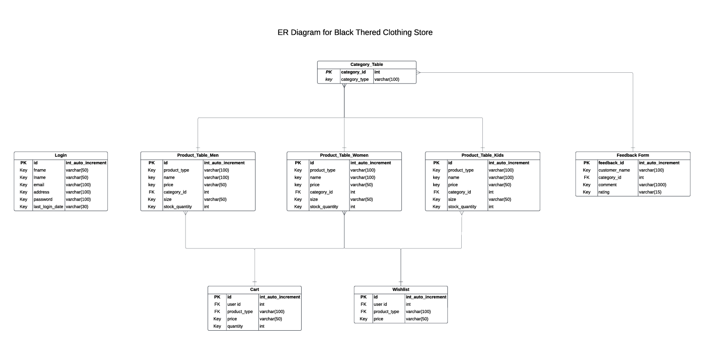

# Web Programming Project - Group 18

Our web development project, BlackThread, is an online clothing store that provides a stylish and seamless shopping experience. The platform features fashion for men, women, and kids, along with exclusive gift vouchers, discounts, and a wish list for users.

# **** Table of Contents ****
Features 
- Database Tables 
- Created Forms
- Created Tables

# **** Features ****
In this section, list and describe the features or functionality that you are working on. You can use checkboxes to track the progress of each feature.

 - Feature 1 :  Login & Registration System.
 - Feature 2 :  New In Men Section.
 - Feature 3 :  New In Women Section.
 - Feature 4 :  New In Kids Section.
 - Feature 5 :  Customer Feedback Section. 
 - Feature 6 :  Cart Section.

 
## Feature 1 - Login & Registration System 
We have created this feature for customers to create their own login, providing access to check their purchasing history.
- github link - https://github.com/ThamaliN/Web-Programming_GRP_18/tree/main/Web-Programming_GRP_18/login
- shell link -  https://shell.hamk.fi/~amk1002388/htmlfile/Project_webProgramming/login/login.php
              https://shell.hamk.fi/~amk1002388/htmlfile/Project_webProgramming/login/register.php  

## Feature 2 - New In Men Section 
We developed this feature for use in the internal store.
- github link - https://github.com/ThamaliN/Web-Programming_GRP_18/blob/main/Web-Programming_GRP_18/input.php
- shell link -  https://shell.hamk.fi/~amk1002093/Web-Programming_GRP_18_Thushara/input.php

## Feature 3 - New In Women Section 
We developed this feature for use in the internal store.
- github link - https://github.com/ThamaliN/Web-Programming_GRP_18/blob/main/Web-Programming_GRP_18/Project%20_%20Group%2018%20-%20Sayuri/inputwomen.php
- shell link -  https://shell.hamk.fi/~amk1002093/Sayuri%20%20php/inputwomen.php

## Feature 4 - New In Kids Section & Delete Function
We developed this feature for use in the internal store. Internal users can delete details of kids' clothing details if they want to.
- github link - https://github.com/ThamaliN/Web-Programming_GRP_18/blob/main/Web-Programming_GRP_18/add_diplay_delete/input_kids.php
- shell link -  http://shell.hamk.fi/~amk1002382/database/input_kids.php

## Feature 5 - Customer Feedback Section 
We have created this feature for customers to rate their clothes and share their experiences in the comment section.
- github link - https://github.com/ThamaliN/Web-Programming_GRP_18/blob/main/Web-Programming_GRP_18/feedbackinput.php
- shell link -  https://shell.hamk.fi/~amk1002093/Web-Programming_GRP_18_Thushara/feedbackinput.php

## Feature 6 - Cart Section 
We created this feature to keep items in the cart during online shopping.
- github link - https://github.com/ThamaliN/Web-Programming_GRP_18/blob/main/Web-Programming_GRP_18/cartindex.php
- shell link -  

# //Database Tables
List the database tables that are part of your project.

- Table 1 (Wimalka Madhavi): Login Table
- Table 2 (Thushara Karunanayaka): Product Table Men & Feedback Table
- Table 3 (Thamali Rathnayke): Product Table Kids & Delete Table Kids
- Table 4 (Sayuri Wijerathna): Product Table Women (ER Diagram & Readme.md file)
- Table 5 (Titus-Muoki): Cart Table  

  

# Created Forms
List and describe any forms that have been created as part of your project. Include details about the purpose of each form and any validation logic.

## Form 1 (Wimalka Madhavi): register.php
- github link - https://github.com/ThamaliN/Web-Programming_GRP_18/tree/main/Web-Programming_GRP_18/login
- shell link -  https://shell.hamk.fi/~amk1002388/htmlfile/Project_webProgramming/login/login.php
              https://shell.hamk.fi/~amk1002388/htmlfile/Project_webProgramming/login/register.php  
- 
## Form 2 (Thushara Karunanayaka): input.php
- github link - https://github.com/ThamaliN/Web-Programming_GRP_18/blob/main/Web-Programming_GRP_18/input.php
- shell link -  https://shell.hamk.fi/~amk1002093/Web-Programming_GRP_18_Thushara/input.php

## Form 3 (Thamali Rathnayke): input_kids.php
- github link - https://github.com/ThamaliN/Web-Programming_GRP_18/blob/main/Web-Programming_GRP_18/add_diplay_delete/input_kids.php
- shell link -  http://shell.hamk.fi/~amk1002382/database/input_kids.php

## Form 4 (Sayuri Wijerathna): inputwomen.php
- github link - https://github.com/ThamaliN/Web-Programming_GRP_18/blob/main/Web-Programming_GRP_18/Project%20_%20Group%2018%20-%20Sayuri/inputwomen.php
- shell link - https://shell.hamk.fi/~amk1002093/Sayuri%20%20php/inputwomen.php

## Form 5 (Titus-Muoki): cartindex.php
- github link - https://github.com/ThamaliN/Web-Programming_GRP_18/blob/main/Web-Programming_GRP_18/cartindex.php
- shell link - 

# Created Tables
List any tables that you have created in the project work

## Table 1 (Wimalka Madhavi): Login Table
- github link - https://github.com/ThamaliN/Web-Programming_GRP_18/tree/main/Web-Programming_GRP_18/login
- shell link -https://shell.hamk.fi/~amk1002388/htmlfile/Project_webProgramming/login/login.php

## Table 2 (Thushara Karunanayaka): (1) Product Table Men & (2) Feedback Table
- (1) github link - https://github.com/ThamaliN/Web-Programming_GRP_18/blob/main/Web-Programming_GRP_18/producttable.php
shell link - https://shell.hamk.fi/~amk1002093/Web-Programming_GRP_18_Thushara/producttable.php

- (2) github link - https://github.com/ThamaliN/Web-Programming_GRP_18/blob/main/Web-Programming_GRP_18/feedbacktable.php
shell link - https://shell.hamk.fi/~amk1002093/Web-Programming_GRP_18_Thushara/feedbacktable.php

## Table 3 (Thamali Rathnayke): Product Table Kids & Delete Table Kids
- github link - https://github.com/ThamaliN/Web-Programming_GRP_18/blob/main/Web-Programming_GRP_18/add_diplay_delete/input_kids.php
- shell link -  http://shell.hamk.fi/~amk1002382/database/input_kids.php

- github link - https://github.com/ThamaliN/Web-Programming_GRP_18/blob/main/Web-Programming_GRP_18/add_diplay_delete/display.php
- shell link - http://shell.hamk.fi/~amk1002382/database/display.php

## Table 4 (Sayuri Wijerathna): Product Table Women 
- github link - https://github.com/ThamaliN/Web-Programming_GRP_18/blob/main/Web-Programming_GRP_18/Project%20_%20Group%2018%20-%20Sayuri/producttablewomen.php
- shell link - https://shell.hamk.fi/~amk1002093/Sayuri%20%20php/producttablewomen.php

## Table 5 (Titus-Muoki): Cart Table 
- github link - https://github.com/ThamaliN/Web-Programming_GRP_18/blob/main/Web-Programming_GRP_18/cartindex.php
- shell link - 
